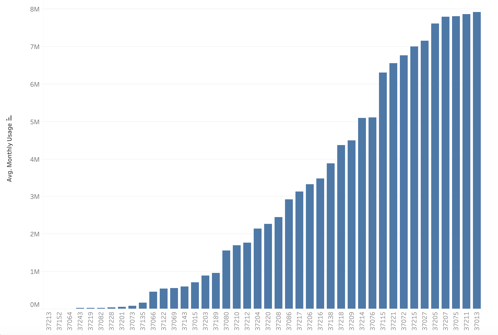

                                        

# Monthly Energy Consumption over Time by Customer Type and ZIP Code in Nashville TN.

## Inspiration 
Nashville is experiencing a rapid growth in its population. It is estimated that an average of 100 people move to Nashville per day (Tennessean, April 2019).  People are looking for a place to settle with their families that fit their budget. According to the estimates above, providing readily available information to visitors on the average energy consumption by zip code per month could alleviate the time spend searching for the right place to live, thus increasing city productivity. 

> 

To address the above problem, I will analyze the Nashville Electric Service data from 2012 to 2018 to find how average energy consumption patterns have changed over time across different zip codes. This will in turn help the current consumers as well as visitors to budget and live where they can afford. 

Within the framework of sustainable development, the energy supply system is one of the most crucial subjects. People spend more time searching for the right place to live and one that suits their lifestyle and budget. I embark on analyzing energy consumption per year/or month to provide the insights of the average usage residential, commercial, outdoor lighting, and seasonal customer. I used correlation analysis, and descriptive analysis. I will also compare the results with the income of the zip code to see if there is any correlation between high income zip codes and energy consumption. 

## Data Selection
To address the above problem, I will analyze the Nashville Electric Service data from 2012 to 2019 to find average energy consumption patterns have changed over time across different Zip codes. This will in turn help the current consumers as well as visitors to budget and live where they can afford. 

The Nashville Electric data was publicly available at [Nashville Electric Service](https://data.nashville.gov/Energy-Usage/NES-Monthly-Energy-Consumption-by-Customer-Type-an/vbx7-mn5i). I also looked at the building permits issued which was obtained publicly at [Nashville Building Permits](https://data.nashville.gov/browse?q=Building%20Permits%20Issued&sortBy=relevance). The datasets was then merged on zip codes and year. 

  

## Data Cleaning
The Data wrangling was done before any analysis took place. The zip code was split from latitude and Longitude. The Customer types dataframes were created and yearly and monthly Electric consumption analyzed over the years. 

## visualization
I created a dashboard that hosted different pieces of information. I used matplotlib.pyploy to create different visualizations. The graphs shown on the left represent the average monthly energy consumption per zip code. The chloropleth map on the right shows the zip codes with the highest energy consumption.
 

The top 10 zip codes with the lowest monthly energy consumption for residential customers is shown below.

I used Tableau to create [Nashville Electric Service(NES) monthly energy consumption](https://public.tableau.com/profile/bush1897#!/vizhome/EnergyConsumption_15781937576950/Mydashboard?publish=yes) dashboard.
